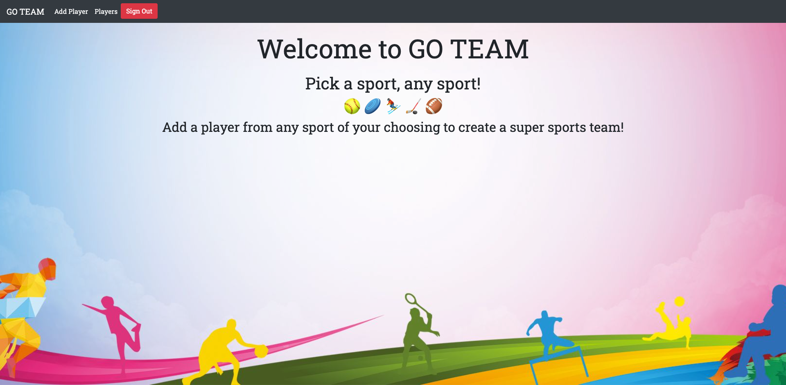
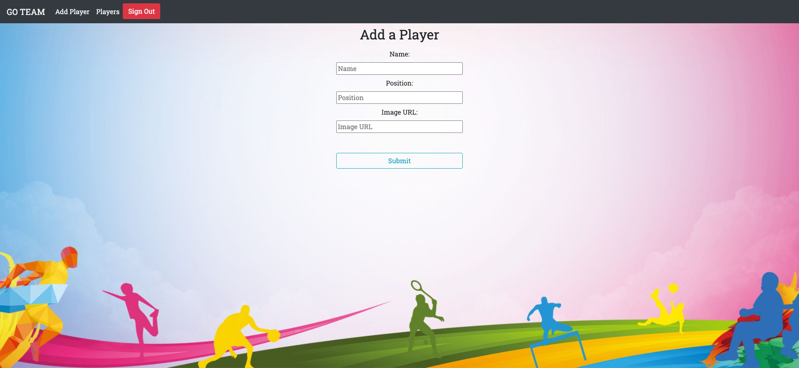
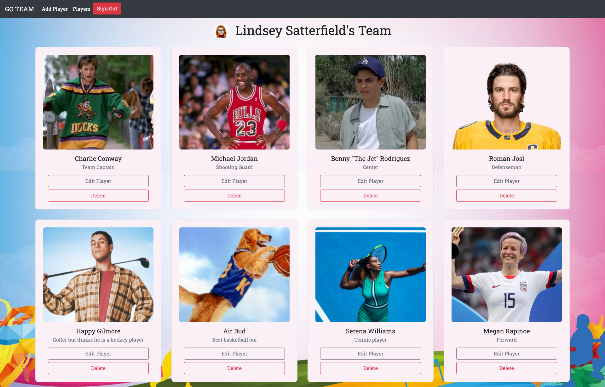

# GO TEAM

#### Overview
GO TEAM is a sports app where a user may create their very own hodgepodge team roster. Pick any sport and any player to create the ultimate sports team! 
#### Deployed Project 
https://lindseysatterfield-go-team.netlify.app

#### Project Board
https://github.com/lindseysatterfield/sports-roster/projects/1

#### Features
- User authentication
- CRUD - user may create, read, update, and delete players
- Only authenticated users may use app features
- User name and profile image appears in the Players view
- Responsive design

#### Technologies
- React
- Vanilla JavaScript
- HTML
- CSS
- Reactstrap
- Sass
- Webpack
- Firebase
#### Screenshots

#### Contributors
[Lindsey Satterfield](https://github.com/lindseysatterfield)

#### Video Walkthrough
[Loom](https://www.loom.com/share/e0511ffc9cd84a3fa8bd0bd4ef0c93dc)
